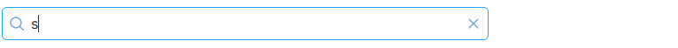

# vue-search-input <a href="https://npm.im/vue-search-input"></a>   

A Vue.js 3 search input component, inspired by the global search input of Storybook and GitHub.



The `SearchInput` component displays a search input with some additional features built-in.

**Features:**

- **Focus** on the search input at any time by pressing the `/` key on the keyboard.
- Includes a default CSS styling but it's also easy to bring your own styles too.
- Completely customizable icons via `slots`
- Displays an `x` icon on the right side of the search input, used for **clearing** the text when there's a value typed inside.
- The search text gets cleared by pressing the `esc` key when the search input has focus (configurable).

**_Important:_** It is advisable that you include the `SearchInput` component **only once** on each page.  
 In case multiple `SearchInput` components are present, the first one being displayed will take focus precedence upon the `/` keypress.

**Demo with examples**

https://vue-search-input.vercel.app

## Installation

```bash
npm i vue-search-input
```

## Usage

```html
<template>
  <SearchInput v-model="searchVal" />
</template>

<script>
import { ref } from 'vue'
import SearchInput from 'vue-search-input'
// Optionally import default styling
import 'vue-search-input/dist/styles.css'

const searchVal = ref('')

export default {
  components: {
    SearchInput
  },
  setup() {
    return {
      searchVal
    }
  }
}
</script>
```

## Styling
`vue-search-input` includes default styling (`dist/styles.css`) with that you can use as a base to create your own CSS.
All the component's elements are inside a `div` which acts a wrapper for the icons and the input.
The default class for the wrapper `div` is `search-input-wrapper` you can override it by providing class(es) to the `SearchInput` component.
> Class and styles bound to the `SearchInput` component will be added to the wrapper `div`.

## Events
> Events bound to the `SearchInput` component will be passed to the `input` element.

| Name | Description | Returned value
| :--- | :--- | :--- |
| update:modelValue | The updated bound model | `string`

## Props
| Name | Type | Description | Default
| :--- | :--- | :--- | :--- |
| type | string | The type of the input field. Allowed types are `search` and `text` | `search` |
| modelValue (v-model) | string | The input's value | `''` |
| wrapperClass | string | The default CSS class of the wrapper div | `search-input-wrapper` |
| searchIcon | boolean | Displays the "search" icon | true |
| shortcutIcon | boolean | Displays the "shortcut" icon | true |
| clearIcon | boolean | Displays the "clear text" icon | true |
| hideShortcutIconOnBlur | boolean | Whether to hide the shortcut icon when the input loses focus | true |
| clearOnEsc | boolean | Whether to clear the input field when the `esc` key is pressed | true |
| blurOnEsc | boolean | Whether to takes the focus out of the input field when the `esc` key is pressed | true |
| selectOnFocus | boolean | Selects the input's text upon `/` keypress | true |
| shortcutListenerEnabled | boolean | Enables the functionality for the `/` keypress | true |
| shortcutKey | string | The `key` for the shortcut functionality | `/` |

## Slots

`vue-search-input` includes some default icons but you can also customize them to suit your needs using the available `slots`.

| Name | Description | Default content
| :--- | :--- | :--- |
| search-icon | Slot for the search icon | `<i class="search-icon search"></i>` |
| shortcut-icon | Slot for the shortcut icon | `<i class="search-icon shortcut" title='Press "/" to search'></i>` |
| clear-icon | Slot for the clear icon <br />`{ clear: () => void }` the function that clears the input |  `<button class="search-icon clear" aria-label="Clear" @mousedown="clear" @keydown.space.enter="clear"></button>`|
| append | Adds an item inside the input wrapper, before the search icon | - |
| append-inner | Adds an item inside the input wrapper, after the search icon | - |
| prepend | Adds an item inside the input wrapper directly after the input element | - |
| prepend-outer | Adds an item inside the input wrapper directly after the clear icon | - |